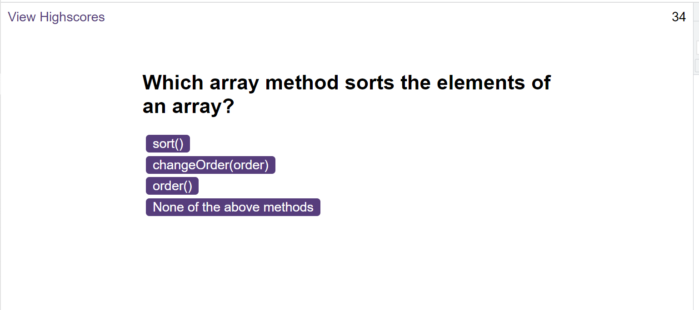

# JavaScript-quiz

- set-up of css file and html were already prepared
- the majority of changes are to be done in JS

# Where to find this
the url at github is https://github.com/ZuzanaElt/JavaScript-quiz
url for the page is https://zuzanaelt.github.io/JavaScript-quiz/

## issues and steps
- setting up a step by step process - This is a bit complex challenge;
- setting up variables that are related to classes in both htmls as well as the future questions. All of these are placed into logic.js. The content of questions used is in questions.js.
- logic.js will  stay available for functions and the process
-scores.js is used for displaying scores in the 2 places where they are required. LocalStorage was used for this

    1. setting up timer interval -this is linked to end of game using local storage
    2. setting up button event that hides the first page and then displayes the first question
    3. the look of the page needs to be amended in JS directly
    - .setAttribute method
      e.g. -   pTag.setAttribute("style","font-weight: normal; font-size:15px;" );

    4. solution for finding index of added button was found on:
https://stackoverflow.com/questions/67427370/is-there-a-way-to-identify-the-index-of-one-button-among-a-list-of-many-buttons
answered by Invizi (thank you Invizi!!)

    5.populating questions div with questions  proved challenging and was achieved through repetition whih is not the ideal. 
    6. creating button evenListeners was not too difficult to figure out
    7. I was also struggling with the counter stopping but I managed to find the correct area to place clearInterval() function.

  All in all, this project was challenging. I am happy with what I managed to achieve but a  questions stayed unanswered.

